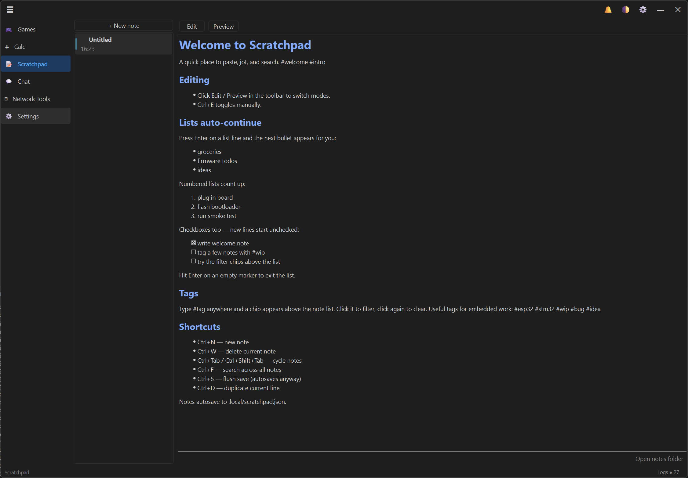
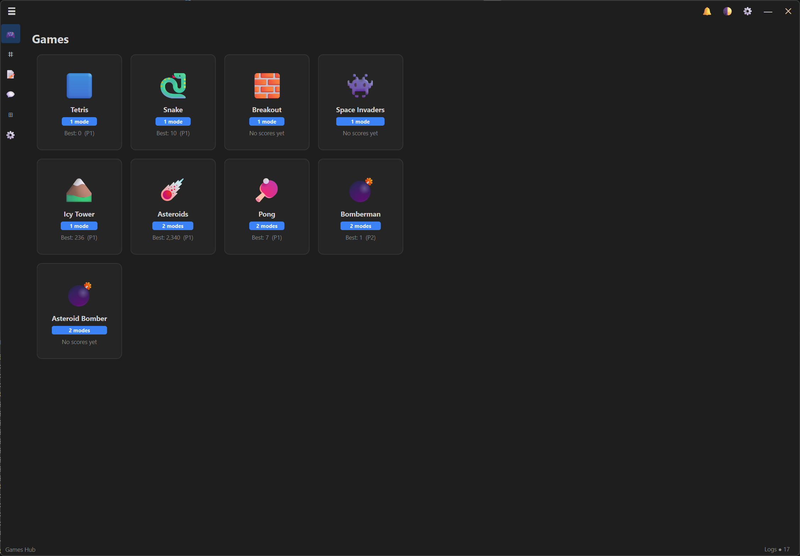
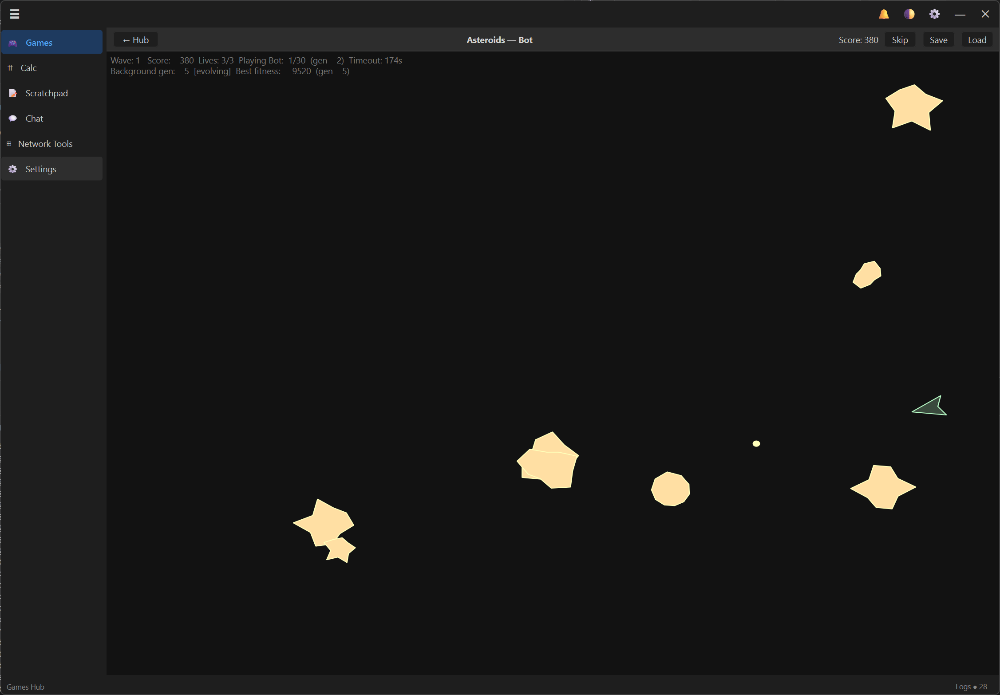
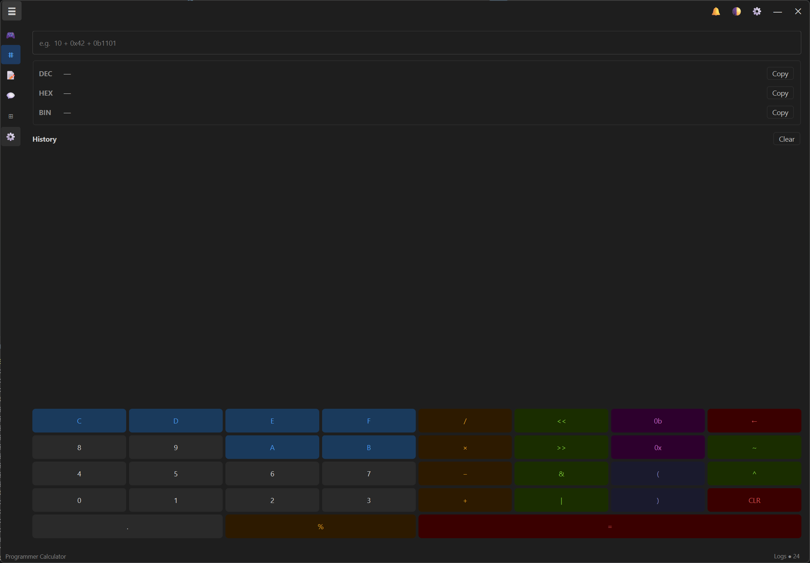

# S.C.A.F.F.O.L.D.

**S**ome **C**ross-platform **A**pp **F**ramework **F**or **O**rganising **L**oosely-coupled **D**evelopment

A PySide6 desktop shell that hosts pluggable sub-apps behind custom chrome.
One window, one tray icon, one settings page — drop in a new sub-app and it
shows up in the sidebar.

---

## What's in the box

| Sub-app | What it does |
|---|---|
| **Scratchpad** | Markdown notepad with live preview, tag chips, auto-continuing lists, full-text search |
| **Programmer Calculator** | DEC / HEX / BIN with bitwise ops and on-screen keypad |
| **Games Hub** | Tetris, Snake, Breakout, Space Invaders, Pong, Bomberman, Icy Tower, Asteroids, Asteroid Bomber — with per-game high scores |
| **Network Tools** | LAN discovery, host probes, interface picker (defaults to RFC1918, not VPNs) |
| **Chat** | In-app message panel built on the typed message bus |
| **Settings** | Aggregated per-sub-app settings, themes, tray behaviour |

Under the hood: extensible sub-app registry, typed message bus, command palette,
toast notifications, system tray, in-app log panel, theme manager.

---

## Screenshots

### Scratchpad


### Games Hub


### Asteroids — Bot mode
A neural network learns to play Asteroids in the background while you watch.


### Programmer Calculator


---

## Requirements

- Python 3.14
- pip (ships with Python)

## Quick start

```powershell
# 1. Create and activate a venv
python -m venv .venv
.\.venv\Scripts\Activate.ps1

# 2. Install dependencies
pip install -r requirements.txt

# 3. Run
python main.py
```

> If PowerShell blocks the activate script, run once:
> `Set-ExecutionPolicy -Scope CurrentUser RemoteSigned`

Or skip steps 1–2 with the one-shot setup script, then activate and run:

```powershell
.\setup.ps1
.\.venv\Scripts\Activate.ps1
python main.py
```

---

## Dependencies

| File | Package | Purpose |
|---|---|---|
| `requirements.txt`     | PySide6 ≥ 6.7    | Qt bindings (UI framework)     |
| `requirements-dev.txt` | ruff ≥ 0.9       | Linter / formatter             |
|                        | pytest ≥ 8.0     | Test runner                    |
|                        | pytest-qt ≥ 4.4  | Qt widget testing helpers      |
|                        | pyinstaller ≥ 6  | Standalone executable packager |

Install dev tools with:

```powershell
pip install -r requirements-dev.txt
```

---

## Development

```powershell
# Lint / format
python -m ruff check .
python -m ruff format .

# Tests
python -m pytest

# Standalone executable (output in dist/)
pyinstaller main.py --name scaffold --windowed --onefile
```
